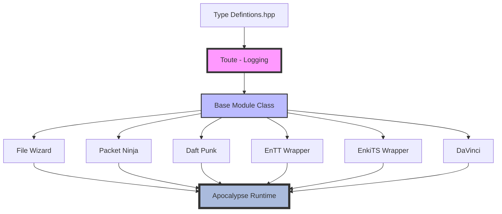
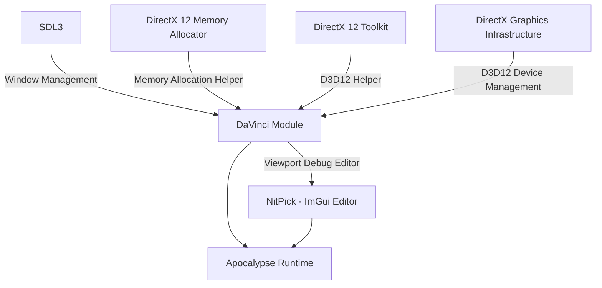

# Segfault-Game-Engine

A Game Engine using DirectX 12 *(D3D12)* and SDL3.

Intended as a learning project.

Do **NOT** use this in any real capacity.

The name alone should be a clue!

## Install
1. Ensure you have [Python 3](https://www.python.org/) installed on your system, all testing has only been done on Windows. Linux Support is en route!

2. To get started, first clone this repo using `git clone --recursive https://github.com/marc-rene/Segfault-Game-Engine.git` - Please don't forget that `--recursive` tag

3. Assuming you're on Windows, open the newly clone repo and run `/Generate Solution.bat` located in the root folder. This is a Windows script that will simply run the `Setup/Setup.py`. If you're on Linux you may need to edit the `Setup/Setup.py` file so that it'll look for a Linux binary of Premake5.

4. Once you've run the script, either by running `/Generate Solution.bat` or running `Setup/Setup.py` directly, a `Segfault.sln` should appear in your root folder. I recommend [Visual Studio 2022](https://visualstudio.microsoft.com/downloads/) if you want to compile the example .hlsl shader files. [Rider](https://www.jetbrains.com/rider/download/?section=windows) is also very good! I recommend running the example projects first to ensure all compile's well! So far, Only `Simple Window` and `Simple Triangle` are working as of writing this.

## About

Ideally I want to try make an Engine that can make an obscenely large-scale version of Dawn of War, but getting it to launch, show a mesh, play some music, is good enough for me :)

  

## Layout

The project is divided up into different modules, all of which could be their own seperate projects.

  

At the top of this hieracchy, you'll have our **Definitions**. This will be a few `#define`'s and minor bits.

  

Inheriting from that will be the **Base Module**, and **Toute**  *(static Logging using ***spdlog***)*.

  

We will then have our different modules:

| | What it does? | Third-Party libraries? |
|---------------------- |------------------------------------------ |---------------------------------- |
|**File Wizard** |Manages all File IO operations |mINI, Rapid-JSON |
|**Packet Ninja** |Manages all TCP/UDP communication |Game Networking Sockets |
|**Daft Punk** |manages all Audio functionality |FMOD, XAudio2 |
|**ENTT Wrapper** |Wrapper for ENTT (ECS) |ENTT |
|**EnkiTS Wrapper** |Wrapper for EnkiTS (Job System) |EnkiTS |
|**DaVinci** |Manages both Renderer and Render API |DXGI, DirectX 12, SDL3, D3D12-M.A |
|**NitPick** |ImGui based Editor and Debugger |ImGui |
|**Apocalypse Runtime** |Client Runtime which combines all modules | |

  

### Modules

  

  
  

### DaVinci Renderer Module

