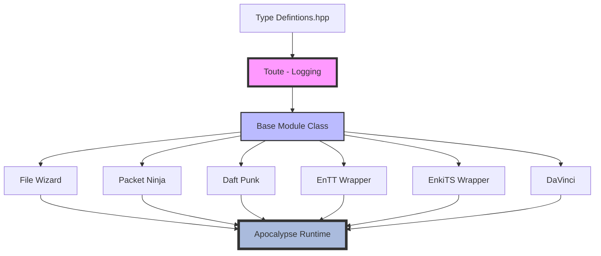
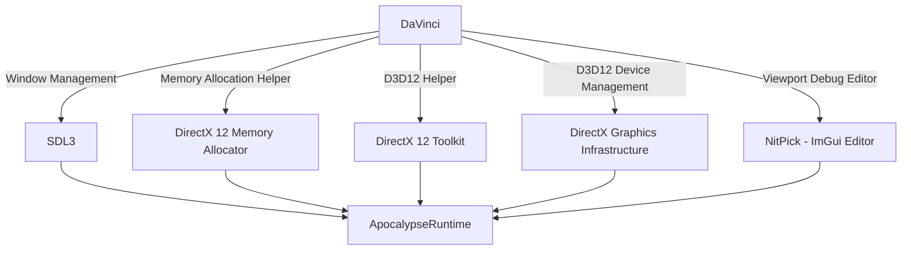

# Segfault-Game-Engine
A Game Engine using DirectX 12 *(D3D12)* and SDL3. 
Intended as a learning project. 
Do **NOT** use this in any real capacity. 
The name alone should be a clue!

## About
Ideally I want to try make an Engine that can make an obscenely large-scale version of Dawn of War, but getting it to launch, show a mesh, play some music, is good enough for me :)

## Layout
The project is divided up into different modules, all of which could be their own seperate projects.

At the top of this hieracchy, you'll have our **Definitions**.  This will be a few `#define`'s and minor bits.

Inheriting from that will be the **Base Module**, and **Toute** *(static Logging using ***spdlog***)*.

We will then have our different modules:
|                       | What it does?                             | Third-Party libraries?            |
|---------------------- |------------------------------------------ |---------------------------------- |
|**File Wizard**        |Manages all File IO operations             |mINI, Rapid-JSON                   |
|**Packet Ninja**       |Manages all TCP/UDP communication          |Game Networking Sockets            |
|**Daft Punk**          |manages all Audio functionality            |FMOD, XAudio2                      |
|**ENTT Wrapper**       |Wrapper for ENTT (ECS)                     |ENTT                               |
|**EnkiTS Wrapper**     |Wrapper for EnkiTS (Job System)            |EnkiTS                             |
|**DaVinci**            |Manages both Renderer and Render API       |DXGI, DirectX 12, SDL3, D3D12-M.A  |
|**NitPick**            |ImGui based Editor and Debugger            |ImGui                              |
|**Apocalypse Runtime** |Client Runtime which combines all modules  |  |

### Modules

### DaVinci Renderer Module

